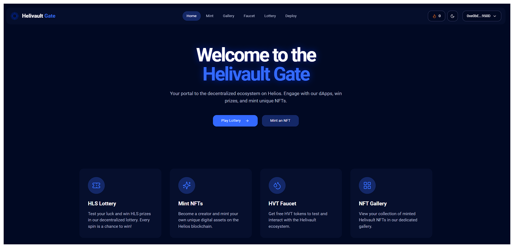

# Helivault Gate



**Live dApp**: [https://helivault-gate.vercel.app/](https://helivault-gate.vercel.app/)

Helivault Gate is a full-stack decentralized application (dApp) built to showcase the capabilities of the Helios testnet. It provides a rich user experience with a suite of features designed for interaction with the Helios ecosystem, including NFT minting, a dynamic gallery, a provably fair lottery, and contract deployment tools.

## ✨ Features

*   **Seamless Wallet Integration**: Connect your wallet with ease using RainbowKit.
*   **Token Faucet**: Instantly get test HVT (Helivault Token) to use across the dApp.
*   **Dynamic NFT Gallery**: Mint unique Helivault NFTs and browse your collection. The gallery includes:
    *   A detailed modal view for each NFT.
    *   Pagination for large collections.
    *   Search and filtering capabilities.
    *   A toggle to view all NFTs minted on the platform.
*   **HLS Lottery**: Participate in a provably fair, tiered lottery to win HLS tokens.
*   **Daily Check-in**: Maintain a streak by checking in daily.
*   **Contract Deployment**: A dedicated interface to deploy and manage your own smart contracts on the Helios network.

## 🛠️ Tech Stack

*   **Frontend**: React, Vite, TypeScript, Tailwind CSS, shadcn/ui
*   **Wallet & Blockchain Interaction**: RainbowKit, Wagmi, Viem, Ethers.js
*   **Smart Contracts**: Solidity, Hardhat
*   **Blockchain**: Helios Testnet

## 🚀 Getting Started

Follow these instructions to set up and run the project locally.

### Prerequisites

*   [Node.js](https://nodejs.org/en/) (v18 or higher)
*   [Git](https://git-scm.com/)
*   A web3 wallet (e.g., MetaMask)

### 1. Clone the Repository

This project uses a git submodule for its smart contracts. Clone the repository recursively to ensure the submodule is included:

```bash
git clone --recurse-submodules <repository-url>
cd helivault-gate
```

### 2. Install Dependencies

Install the dependencies for both the frontend and the smart contracts submodule:

```bash
# Install frontend dependencies
npm install

# Install smart contract dependencies
cd helivault-contracts
npm install
cd ..
```

### 3. Set Up Environment Variables

The smart contracts require environment variables for deployment. Create a `.env` file inside the `helivault-contracts` directory:

```bash
touch helivault-contracts/.env
```

Add the following variables to the new file. **Never commit this file to version control.**

```env
# helivault-contracts/.env

HELIOS_RPC_URL=https://helios-testnet.rpc.thirdweb.com
PRIVATE_KEY=YOUR_WALLET_PRIVATE_KEY
```

### 4. Run the Application

You can now run the frontend development server:

```bash
npm run dev
```

The application will be available at `http://localhost:5173` (or another port if 5173 is in use).

## 📜 Available Scripts

### Frontend (root directory)

*   `npm run dev`: Starts the Vite development server.
*   `npm run build`: Builds the application for production.
*   `npm run lint`: Lints the codebase using ESLint.
*   `npm run typecheck`: Runs the TypeScript compiler to check for type errors.

### Smart Contracts (`helivault-contracts` directory)

*   `npx hardhat compile`: Compiles the smart contracts.
*   `npx hardhat test`: Runs the test suite for the contracts.
*   `npx hardhat run scripts/deploy.ts --network heliosTestnet`: Deploys the contracts to the Helios testnet.